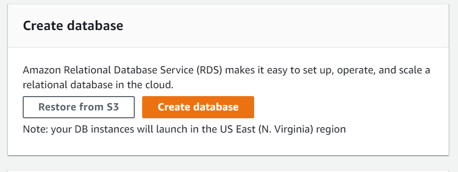
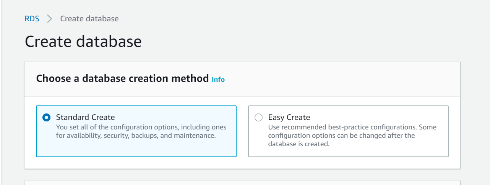
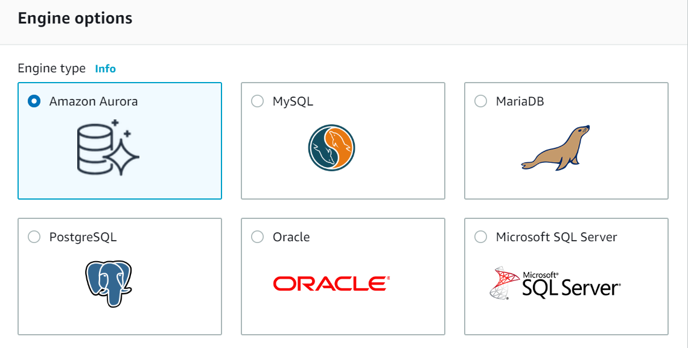
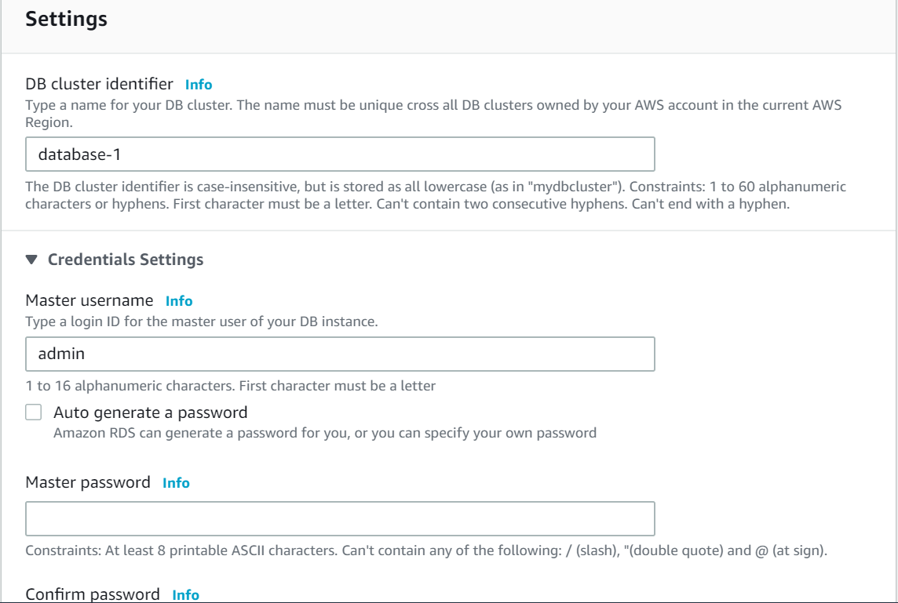
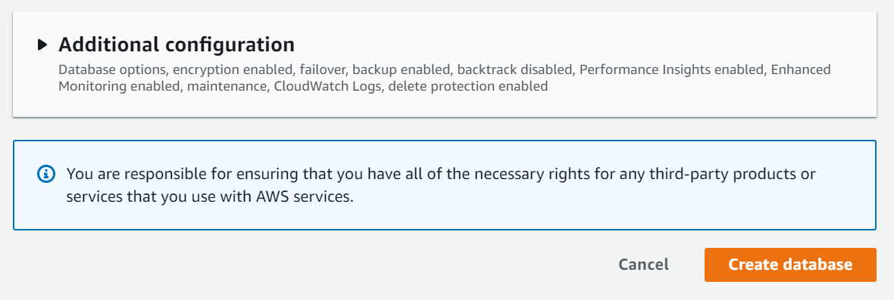

# commands

- $ : not in root(admin) user.

- sudo su : to be in root user.

- ls : list all the directory/files.

- pwd : print working directory.

- cd : change directory.

- mkdir : creates directory.

- vi : tool/program (notepad)

- i : insert mode

- :wq : write and quit from current file.

# RDS (Relational Database Service)

One of the services we studied today is database.One can create database either by standard create or easy create along with engine options, versions etc.
we have to set a db instance identifier and a username and password.It has a option of storage type where you can allocate size as required.
database port at default is selected i.e., 3306, and create the database.The endpoint and port in the connectivity and security options is the url.Hence, you can setup new connection to MySQL Workbench.

<h4> Steps to create RDS Database instance </h4>

1. Sign in to AWS Console and open Amazone RDS Console.

2. Choose the AWS region in which you want to create the DB instance.

3. Choose Database.

4. Chosse Create database.

5.On the Create database page, choose either standard create or easy create where the latter is the aws one,where some options are selected by default. 

6.In Engine Options choose the the engine you want.

7.Next choose Dev/Test.

8. In the setting choose:

DB instance identifier - give name to your database

Master Username :give username

Master password : Create a password

Confirm password : Retype the password

After selecting all the options, press Create database . This will create your RDS in AWS.

